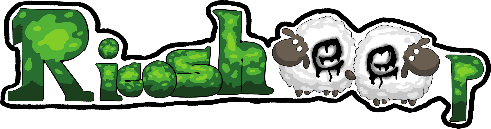
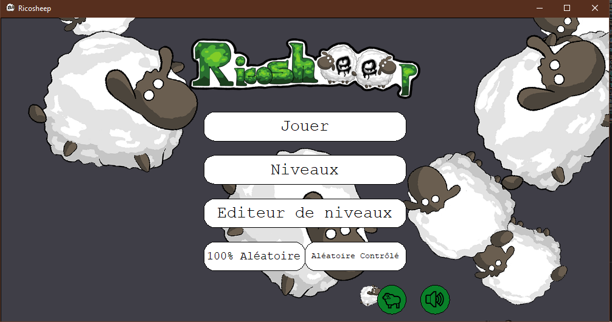

<p style="text-align: center;">

</p>

---

<h2 style="text-align: center;"> Projet informatique 2 <br> 
L1 Mathématiques et Informatique <br>
Année 2021-2022 - Semestre 2 <br>
<a href = https://github.com/AdamSouiou/PR2-Ricosheep> https://github.com/AdamSouiou/PR2-Ricosheep </a>

<h3 style="text-align: center;"> Réalisé par: Amal Abdalah, Nicolas Seban et Adam Souiou</h3>
  </h2>

---

<h1 style= "text-align:center"> Sommaire </h1>

<div style = "text-align:center">

## [Manuel d'utilisateur](#Manuel) 
## [Etat d'avancement du projet](#Etat)
## [Organisation du travail](#Organisation)
## [Conclusion](#Conclusion)
## [Crédits](#Crédits)

</div>

---
<div style="page-break-after: always;"></div>


---
<div style = "text-align:center">

# <a name="Manuel">Manuel d'utilisateur</a>
</div>

## **Installation**
Pour pouvoir jouer à Ricosheep, il vous faudra installer deux bibliothèques.

- PIL qui est essentiel pour le bon fonctionnement du programme.
- Pygame pour pouvoir profiter des sons et des musiques, bien qu'optionnel

Pour installer PIL et pygame il suffit de taper dans le terminal :
```
pip install pillow pygame
```
## **Lancement du programme**
Pour lancer le jeu Ricosheep. Il suffit de vous placer dans le dossier Ricosheep grâce au terminal :
```
cd [emplacement du dossier]
```
Puis pour lancer le jeu :
```
python ricosheep.py
```

## **Naviguation dans les menus**
En lançant le jeu, vous découvrirez le menu d'accueil suivant :



Plusieurs choix s'offrent à vous :

- **"Jouer"** permet de jouer sur un niveau selectionner.<br>
Par défaut il s'agit du niveau jouer dans la session précédente ou un niveau par défaut.

- **"Niveaux"** permet de choisir un niveau parmis tous ceux installer dans le dossier "maps", l'exploration se fait à la souris.<br>

- **"Editeur de niveaux"** nous permet de créer un niveaux et par la suite de le sauvegarder.

- **"100% Aléatoire"** permet de générer une grille complètement aléatoire entre un plateau 4x4 cases et 9x9 cases résoluble.

- **"Aléatoire contrôlé"** permet de générer un niveau aléatoire en prenant comme paramètre entré par le joueur:
  - La taille de la grille<br>
  - Le nombre de moutons
  - Le nombre de touffes d'herbes
  - Nombre de coups pour réussir le niveau.
  
- Les boutons circulaire en bas de l'écran permettent d'activer ou désactiver les divers sons, ainsi que l'animation d'arrière plan sur l'écran d'accueil.

## **Règles du jeu**

Le jeu se joue en tours successifs. À chaque tour, le joueur peut déplacer les moutons de la façon suivante :

- Le joueur choisit une instruction aux moutons en choississant une direction parmi Haut, Gauche, Droite ou Bas.
- Les moutons se déplacent en troupeau : tous les moutons suivent l'instruction donnée.
- Les moutons effectuent le déplacement maximal dans la direction donnée, donc jusqu'à être bloqué par un buisson, le bord du plateau ou bien un autre mouton.
- Les moutons ne peuvent pas se superposer sur la même case.

Le but du jeu est que chaque touffe d'herbe reçoit un mouton. Mais attention, il se peut que certains coups ne soient pas reversible, et donc le joueur perd la partie.


## **Comment jouer**

Lorsque vous cliquer sur jouer ou un niveau généré aléatoirement vous obtiendrez l'écran suivant.


La partie principale est réservé au jeu tandis que la colonne à droite sert pour différente fonctionnalité.<br>
Le troupeau de mouton est contrôlé avec les flèches du clavier.<br>

Sur le panneau de droite on a:
- **Reset** : qui permet de réinitialiser le plateau à l'état de départ.
- **Undo** : qui permet d'annuler un mouvement pour revenir à l'étape d'avant.
- **Sauvegarde** : qui permet de sauvegarder la partie, qui sera automatiquement chargé si le joueur clique sur "jouer" lors d'une future session.
- **Sol. profondeur** : qui permet d'avoir une solution au niveau rapidement mais pas minimal.
- **Sol. largeur** : qui permet d'avoir une solution minimal au niveau.
- **Quitter** : qui permet de revenir à l'écran d'accueil.

Sur l'éditeur de niveaux, il suffit de cliquer sur une case pour continuer le cycle entre "Vide", "Buisson", Mouton", et "Herbes. Puis d'appuyer sur entrée pour tester le niveau.

---
<div style="page-break-after: always;"></div>

---
<div style = "text-align:center">

# <a name="Etat">Etat d'avancement du projet</a>
</div>

## **Fonctionnalités réalisées et non réalisées**
- Fonctionnalités réalisées:
  - Interface 100% graphique 
  - Utilisation complète du programme dans l'interface graphique
  - Selecteur de niveaux dans le programme
  - Détection de la défaite
  - Fonction "Retour en arrière"
  - Créateur de niveaux avec sauvegarde du niveau créé
  - Sauvegarde et chargement de partie avec détection d'une sauvegarde déjà présente
  - Solveur de niveaux
  - Solveur avec recherche d'une solution minimale
  - Affichage de solutions
  - Générateur de niveaux 100% aléatoire resolubles
  - Générateur de niveaux avec difficultés choisies

- Fonctionnalités non-réalisées:
  - Solveur graphique
  - Ajout de règles de jeu avec des herbes et des moutons colorés
  - Ajout de règles de jeu avec des loups
  - Menu d'option pour changer la taille de la fenêtre en cours d'exécution

## **Problèmes connus**
Aucun problème connu à ce jour.

## **Améliorations réalisées**
- Vérification des fichiers avant le lancement du jeu
- Ajout de champs de textes
- Automatisation de boutons
  - Avec possibilité d'arrondir les angles
- Icone de fenetre
- Logo de jeu
- Animation de déplacements
- Animation du menu d'accueil
- Ambiances et effets sonores

## **Explications des choix**

### **L'utilisation des classes :**
L'utilisation des classes nous a permis de fortement simplifier la gestion et l'implémentation de fonctionnalités autour de celle-ci, de pouvoir jongler facilement avec différent paramètre en cas de besoin.
C'est ainsi que nous avons une grille de boutons qui permet de placer la grille de plateau, permettant d'avoir une air de jeu délimité proprement et confortablement.

### **Son et animation :**
Bien que ce ne soit purement esthétique, les animations et autres effets sonores donnent un côté fini très agréable au jeu, Améliorant ainsi considérablement le plaisir de jouer.

### **La non-réalisation des différentes règles de jeu:**
Nous avons préféré nous concentrer sur le jeu de base ainsi que sur un plus grand nombre de fonctionnalités utilisable plutôt que d'ajouter des règles qui impacteraient les solveurs, générateurs aléatoires, et éditeur de niveaux.


---

<div style="page-break-after: always;"></div>

---
<div style = "text-align:center">

# <a name="Organisation">Organisation du travail</a>
</div>

## **Communication et synchronisation du groupe**
Nous communiquions énormément sur la plateforme de messageries instantanée *Discord*, nous permettant ainsi de nous donner mutuellement des tâches, de prévenir le groupe sur nos avancées , et ainsi avoir un travail fluide et efficace.

## **Répartition quantifiée des tâches**
- **Amal ABDALLAH : 40%**
  - Solveur en profondeur
  - Logo, dessin des moutons pour l'animation du menu d'accueil
  - Animation du menu d'accueil, Ambiance/Effet sonore
  - Editeur de niveaux (avec sauvegarde de niveaux)
  - Générateur de niveaux aléatoire (/à difficulté choisies)
  - Sauvegarde et Chargement d'une partie
  - Selecteur de niveaux dans l'interface graphique
  - Algorithme de déplacements de moutons
  - Menu d'accueil
  - Gestion du fichier de configuration
  - Modification de fltk pour ajouter des champs de textes
  - Ecran de fin de jeu
  - Réinitialisation du plateau
  - Vérification des fichiers avant le lancement du jeu
  - Correction de bugs
  - Détecteur de défaite
  - Boutons de fonctionnalités pendant une partie

- **Nicolas SEBAN : 40%**
  - Moteur du jeu
  - Classe du plateau de jeu
  - Création et gestions des divers boutons
  - Exception pour le parsing
  - Interface graphique
  - Affichage graphique de la solution
  - Animation des déplacements
  - Retour en arrière
  - Prévisualisation des maps dans le menu de selection de niveaux
  - Fenetre de jeu avec une icône
  - Optimisation du programme
  - Correction de bugs
  - Création de test unitaire

- **Adam SOUIOU : 20%**
  - Création d'un plateau à partir d'un fichier texte
  - Détection de victoire
  - Solveur a solution minimale


## **Difficultés rencontrées**

Les difficultés rencontrées dans ce projet sont :

- Les champs de textes à implémenter dans fltk.
- Le solveur à solution minimal
- Générateur de niveaux à difficultés choisies
- Calcul de la taille des textes pour le bouton

---


<div style="page-break-after: always;"></div>

---
<div style = "text-align:center">

# <a name="Conclusion">Conclusion</a>
</div>

## **Pistes d'améliorations, projets inachevés**

- Améliorations :
  - L'ajout des règles de moutons et herbes colorés
  - L'ajout de règle des loups
- Projets Inachevés :
  - Solveur graphique

## **Commentaire libre**

### Ce qui nous a plu :
  - Les Générateurs de niveaux aléatoires
  - L'Ambiance et les effets sonores
  - Les animations de déplacements
  - Solveur à solutions minimales
  - L'interface graphique

### Ce qui nous a déplu :
  - La rigidité de fltk et le besoin constant d'implémenter des fonctionnalités estimés essentielles
    - Boite de textes, redimenssionnement et rotation des images


### Ce qu'on ferait différemment :
- Une organisation plus contrôlée
- Une meilleure gestion du temps pour implémenter d'autres fonctionnalités

---

# <a name = Crédits> Crédits </a>

## **Effets sonores**
- Les effet sonore des menus sont tirés du jeu Sonic Mania
- Les sons des moutons sont tirés du jeu Minecraft

## **Musique**
- *Otherside* par Lena Raine
- *Wait* par C418
